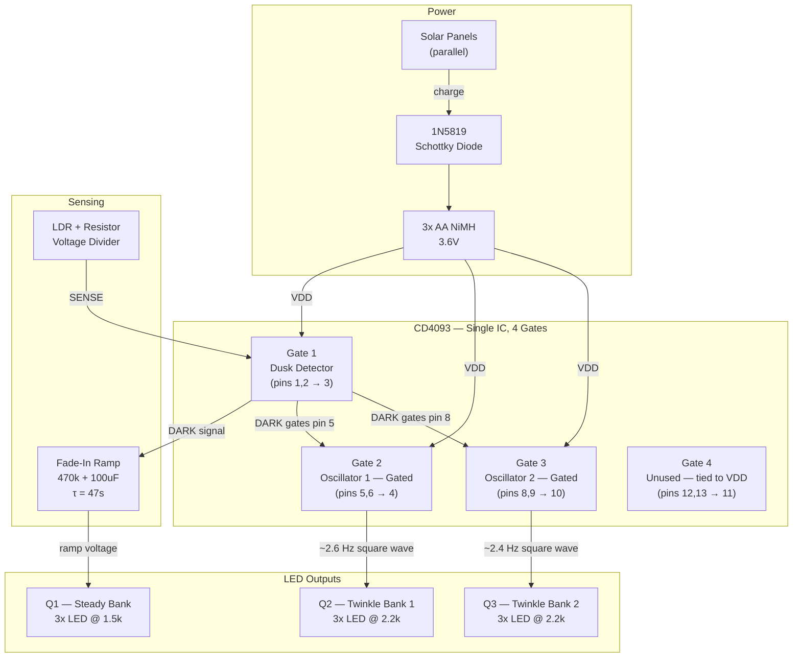
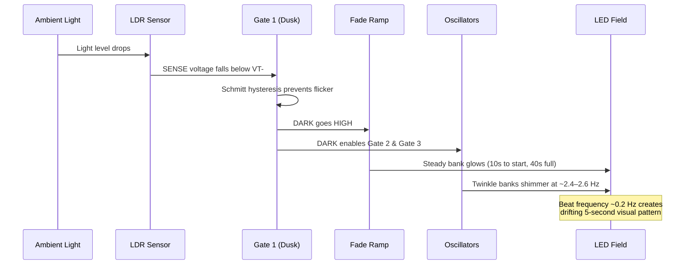

# Solar-Powered Dual Oscillator "Diamond Mine" LED System

## Corrected Design — February 2026

A solar-charged, dusk-activated LED shimmer circuit using only analog CMOS logic and
transistors. No microcontroller. Extremely low power. Suitable for indoor solar use.

## Documents

| File | Contents |
|------|----------|
| [circuit-evaluation.md](circuit-evaluation.md) | Full accuracy review with issues and fixes |
| [schematic.md](schematic.md) | Corrected wiring schematic with all gate assignments |
| [breadboard-layout.md](breadboard-layout.md) | Clean physical layout with wire color guide |
| [bill-of-materials.md](bill-of-materials.md) | Complete parts list with values and notes |

## System Overview

## Signal Flow at Dusk

## Design Achievements

- Solar self-sufficiency (indoor panels)
- Smooth dusk activation with Schmitt hysteresis
- Gentle 40-second fade-in bloom
- Multi-layer organic shimmer from dual oscillator beats
- ~10 mA active draw / <5 uA standby
- No microcontroller, no regulator, no firmware
