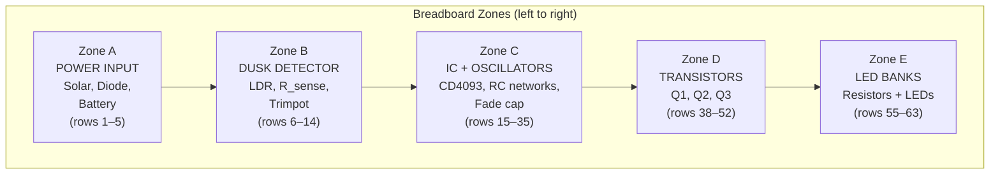
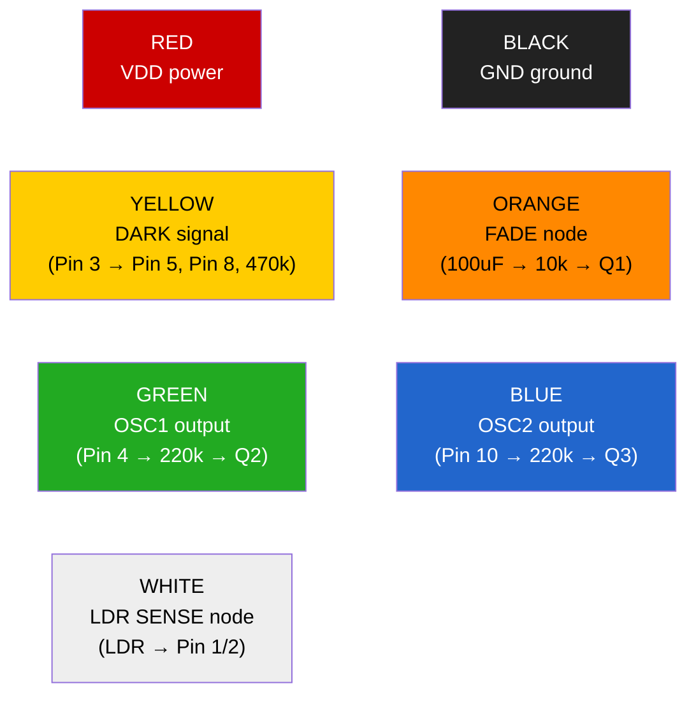

# Breadboard Layout — Diamond Mine Shimmer (Corrected)

## Board Overview

Standard 830-point solderless breadboard. Power rails top and bottom, IC centered,
components grouped by function zone.



---

## Power Rails

```
(+) rail ═══════════════════════════════════════════════ VDD (Battery+)
                    board top edge

 ... breadboard rows ...

(−) rail ═══════════════════════════════════════════════ GND (Battery−)
                    board bottom edge
```

Place a **0.1uF ceramic cap** spanning (+) and (−) rails near the IC location (around row 15).

---

## Zone A: Power Input (rows 1–5)

```
Row 1:  Solar+ wire → 1N5819 anode (band faces right)
Row 3:  1N5819 cathode → jumper wire to (+) rail
Row 1:  Solar− wire → jumper to (−) rail
        Battery+ → (+) rail
        Battery− → (−) rail
```

---

## Zone B: Dusk Detector (rows 6–14)

```
Row 6:   (+) rail → LDR leg 1
Row 8:   LDR leg 2 (SENSE node)
Row 8:   jumper from here → Row 15 (Pin 1/2 node)
Row 8:   470k resistor: Row 8 → Row 11
Row 11:  100k trimpot wiper → Row 11
         trimpot end 1 → Row 11 (connects to 470k)
         trimpot end 2 → (−) rail
Row 11:  47k resistor → (−) rail
```

---

## Zone C: IC + Oscillators (rows 15–35)

### CD4093 Placement

IC straddles center channel at rows 15–21:

```
         Column E (lower)     Column F (upper)
Row 15:    Pin 1  ──────────  Pin 14    → wire to (+) rail
Row 16:    Pin 2  ──────────  Pin 13    → wire to (+) rail
Row 17:    Pin 3  ──────────  Pin 12    → wire to (+) rail
Row 18:    Pin 4  ──────────  Pin 11    (no connection)
Row 19:    Pin 5  ──────────  Pin 10
Row 20:    Pin 6  ──────────  Pin 9
Row 21:    Pin 7  ──────────  Pin 8
             │
             └→ wire to (−) rail
```

### IC-Side Jumpers

| From | To | Purpose |
|------|----|---------|
| Row 15 col A (Pin 1) | Row 16 col A (Pin 2) | Tie Gate 1 inputs together |
| Row 16 col J (Pin 13) | (+) rail | Tie Gate 4 input A to VDD |
| Row 17 col J (Pin 12) | (+) rail | Tie Gate 4 input B to VDD |
| Row 15 col J (Pin 14) | (+) rail | IC power |
| Row 21 col E (Pin 7) | (−) rail | IC ground |

### DARK Signal Distribution (Pin 3, Row 17)

| From | To | Purpose |
|------|----|---------|
| Row 17 col A | Row 19 col A (Pin 5) | Gate oscillator 1 |
| Row 17 col A | Row 21 col J (Pin 8) | Gate oscillator 2 |
| Row 17 col B | Row 23 (470k to FADE) | Start of fade ramp |

### Fade-In Ramp

```
Row 23:  470k resistor: Row 17 col C → Row 23
Row 25:  100uF electrolytic (+) at Row 25, (−) to (−) rail
         Row 23 → Row 25 jumper (FADE node)
```

### Oscillator 1 (Gate 2)

```
Row 18 col A (Pin 4 output):
    1M resistor: Row 18 col A → Row 28
Row 28:
    100k trimpot: Row 28 → Row 30
Row 30 (RC1 node):
    jumper → Row 20 col A (Pin 6)
    0.47uF film cap: Row 30 → (−) rail
```

### Oscillator 2 (Gate 3)

```
Row 19 col J (Pin 10 output):
    1M resistor: Row 19 col J → Row 33
Row 33:
    100k trimpot: Row 33 → Row 35
Row 35 (RC2 node):
    jumper → Row 20 col J (Pin 9)
    0.47uF film cap: Row 35 → (−) rail
```

---

## Zone D: Transistors (rows 38–52)

All transistors are 2N3904 NPN. Flat side facing you, pins left-to-right: E, B, C.

### Q1 — Steady Bank Driver

```
Row 40:  col A = Emitter → (−) rail
         col B = Base    ← 10k ← FADE node (Row 25)
         col C = Collector → jumper to Steady LED bank
```

### Q2 — Twinkle Bank 1 Driver

```
Row 45:  col A = Emitter → (−) rail
         col B = Base    ← 220k ← Pin 4 / OSC1 (Row 18 col A)
         col C = Collector → jumper to Twinkle LED bank 1
```

### Q3 — Twinkle Bank 2 Driver

```
Row 50:  col A = Emitter → (−) rail
         col B = Base    ← 220k ← Pin 10 / OSC2 (Row 19 col J)
         col C = Collector → jumper to Twinkle LED bank 2
```

---

## Zone E: LED Banks (rows 55–63)

Each LED: anode → resistor → (+) rail, cathode → transistor collector.

### Steady Bank (1.5k per LED, cathodes → Q1 collector at Row 40 col C)

```
Row 55:  1.5k from (+) rail → LED anode, LED cathode → wire to Row 40 col D
Row 56:  1.5k from (+) rail → LED anode, LED cathode → wire to Row 40 col D
Row 57:  1.5k from (+) rail → LED anode, LED cathode → wire to Row 40 col D
```

### Twinkle Bank 1 (2.2k per LED, cathodes → Q2 collector at Row 45 col C)

```
Row 58:  2.2k from (+) rail → LED anode, LED cathode → wire to Row 45 col D
Row 59:  2.2k from (+) rail → LED anode, LED cathode → wire to Row 45 col D
Row 60:  2.2k from (+) rail → LED anode, LED cathode → wire to Row 45 col D
```

### Twinkle Bank 2 (2.2k per LED, cathodes → Q3 collector at Row 50 col C)

```
Row 61:  2.2k from (+) rail → LED anode, LED cathode → wire to Row 50 col D
Row 62:  2.2k from (+) rail → LED anode, LED cathode → wire to Row 50 col D
Row 63:  2.2k from (+) rail → LED anode, LED cathode → wire to Row 50 col D
```

---

## Wire Color Guide



| Color | Signal | From → To |
|-------|--------|-----------|
| Red | VDD | (+) rail → Pin 14, Pin 12, Pin 13, LDR, LED resistors |
| Black | GND | (−) rail → Pin 7, all emitters, caps, R_sense |
| Yellow | DARK | Pin 3 → Pin 5, Pin 8, 470k fade resistor |
| Orange | FADE | 470k/100uF junction → 10k → Q1 base |
| Green | OSC1 | Pin 4 → 1M (feedback) and 220k → Q2 base |
| Blue | OSC2 | Pin 10 → 1M (feedback) and 220k → Q3 base |
| White | SENSE | LDR → Pin 1, Pin 2, R_sense |

---

## Layout Tips

1. **Keep bypass cap close to IC** — The 0.1uF ceramic should be within 1–2 rows of pins 7 and 14.
2. **Electrolytic polarity** — The 100uF fade cap has a stripe marking the negative leg. Negative to (−) rail.
3. **Trimpot orientation** — Mount trimpots with adjustment screw facing outward for easy tuning.
4. **LED polarity** — Longer leg = anode (goes toward resistor/VDD). Flat edge on lens = cathode (goes toward transistor).
5. **Transistor orientation** — 2N3904 flat side facing you: E (left), B (center), C (right). Verify with datasheet for your specific package.
6. **Film vs electrolytic** — Use film caps (0.47uF) for oscillators (non-polarized). Use electrolytic (100uF) only for the fade ramp (polarized, observe +/−).
