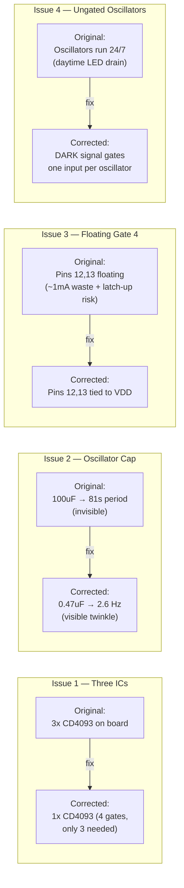
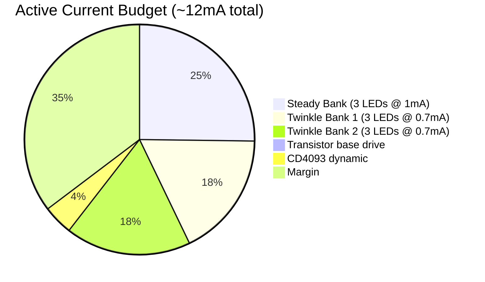

# Circuit Evaluation — Diamond Mine Shimmer

## What Works Well

- **Dusk detector** — LDR-to-ground voltage divider with both Gate 1 inputs tied (inverter mode)
  plus Schmitt hysteresis is textbook and reliable. No twilight flicker.
- **Fade-in ramp** — 470k + 100uF (τ = 47s) is well-chosen. LEDs begin glowing at ~10 seconds,
  full brightness around 40 seconds. Organic and pleasant.
- **Dual non-synchronized oscillators** — Two square waves at slightly different frequencies
  create beat patterns that never repeat mechanically. Elegant analog trick.
- **Low-side NPN switching** with per-LED current limiting resistors is clean and efficient.
- **1N5819 Schottky** for solar charge blocking — correct part, low forward voltage preserves
  precious millivolts from the 3.6V supply.
- **Power budget** — ~10–15 mA active draw with 2000 mAh NiMH gives 130+ hours of darkness
  run-time. Indoor solar easily replenishes this.

---

## Critical Issues Found



### Issue 1: Three CD4093 ICs shown — only one needed

**Impact:** Wasteful. A single CD4093 contains 4 NAND gates. The design uses only 3.

**Fix:** Use one CD4093. Gate assignments:

| Gate | Pins | Function |
|------|------|----------|
| 1 | 1, 2 → 3 | Dusk detector (inverter mode) |
| 2 | 5, 6 → 4 | Oscillator 1 (gated by DARK) |
| 3 | 8, 9 → 10 | Oscillator 2 (gated by DARK) |
| 4 | 12, 13 → 11 | Unused — inputs tied to VDD |

### Issue 2: Oscillator 1 uses 100uF capacitor — far too slow

**Impact:** Period = 0.81 × 1M × 100uF = **81 seconds**. No visible twinkling — just an
extremely slow fade cycle.

**Fix:** Replace with **0.47uF** film capacitor.

| R | C | Period | Frequency | Visual effect |
|---|---|--------|-----------|---------------|
| 1M | 100uF | 81s | 0.012 Hz | Invisible (original — broken) |
| 1M | 0.47uF | 0.38s | 2.6 Hz | Quick shimmer (corrected) |
| 1M | 1.0uF | 0.81s | 1.2 Hz | Slow gentle twinkle |
| 1M | 2.2uF | 1.78s | 0.56 Hz | Very slow breathing pulse |

### Issue 3: Gate 4 inputs left floating

**Impact:** Floating CMOS inputs oscillate rail-to-rail internally, causing ~1 mA excess
quiescent current and possible latch-up damage.

**Fix:** Tie pins 12 and 13 directly to VDD. Pin 11 (output) left unconnected.

### Issue 4: Oscillators run during daylight

**Impact:** Twinkle transistors cycle LEDs at ~1 mA average even in full sun, draining
the batteries the solar panels are trying to charge.

**Fix:** Use one input per oscillator gate for the DARK signal:

```
Gate 2:  Pin 5 ← DARK (pin 3)     ← gating input
         Pin 6 ← RC node           ← oscillator feedback
         Pin 4 → output

Gate 3:  Pin 8 ← DARK (pin 3)     ← gating input
         Pin 9 ← RC node           ← oscillator feedback
         Pin 10 → output
```

**NAND behavior makes this work:**
- DARK = LOW (daylight): Output stuck HIGH regardless of RC input. No oscillation. Zero LED current.
- DARK = HIGH (night): Gate acts as inverter on RC input. Normal oscillation.

---

## Minor Issues

| # | Issue | Notes |
|---|-------|-------|
| 5 | Twinkle banks lack fade-in | They switch on/off abruptly once oscillators start. Steady bank fades but twinkle banks don't. Acceptable aesthetically — twinkling "emerges" after dusk detector trips. |
| 6 | No power switch | Fine for permanent install. Add SPST between battery and circuit for debugging. |
| 7 | White/blue LEDs may be very dim | At 3.6V with Vf ~3.0V and 2.2k resistor, only ~0.27 mA flows. Use red/amber/yellow (Vf ~1.8–2.1V) for best results. |
| 8 | No over-discharge protection | NiMH damaged below 1.0V/cell. CD4093 stops below ~3V — natural but imprecise cutoff. |

---

## Current Draw Summary



| State | Current | Battery Life (2000mAh) |
|-------|---------|------------------------|
| Daylight (standby) | < 5 uA | Effectively infinite |
| Darkness (all LEDs) | ~10–12 mA | ~170–200 hours |
| Darkness (typical duty) | ~7–8 mA | ~250+ hours |
