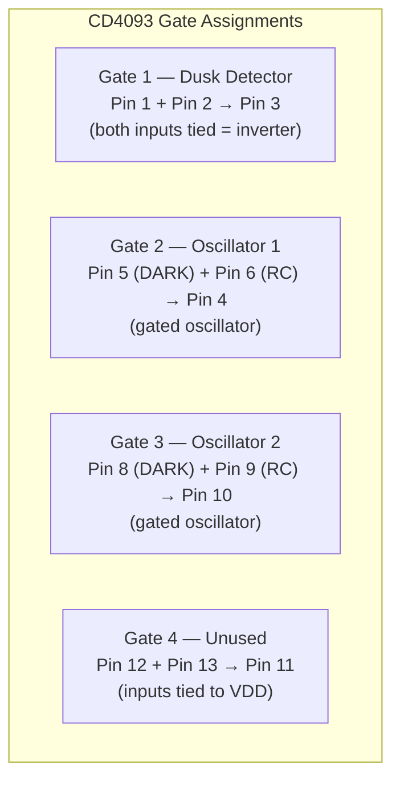
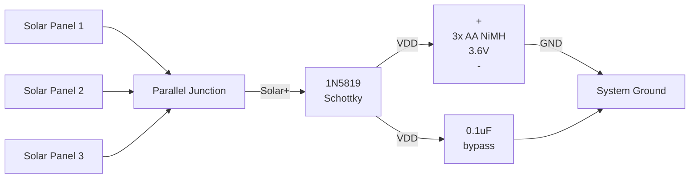
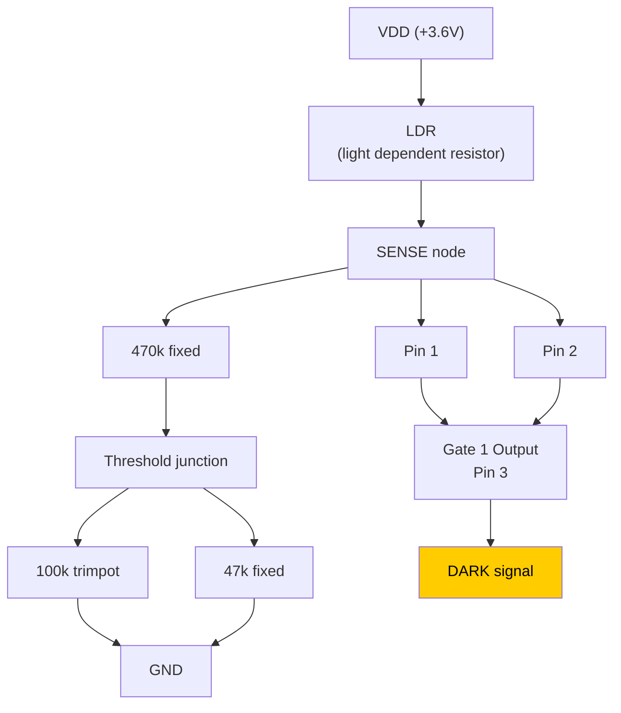
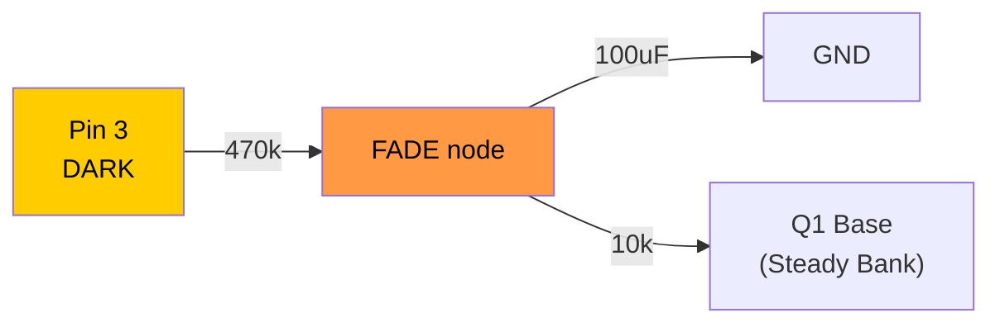
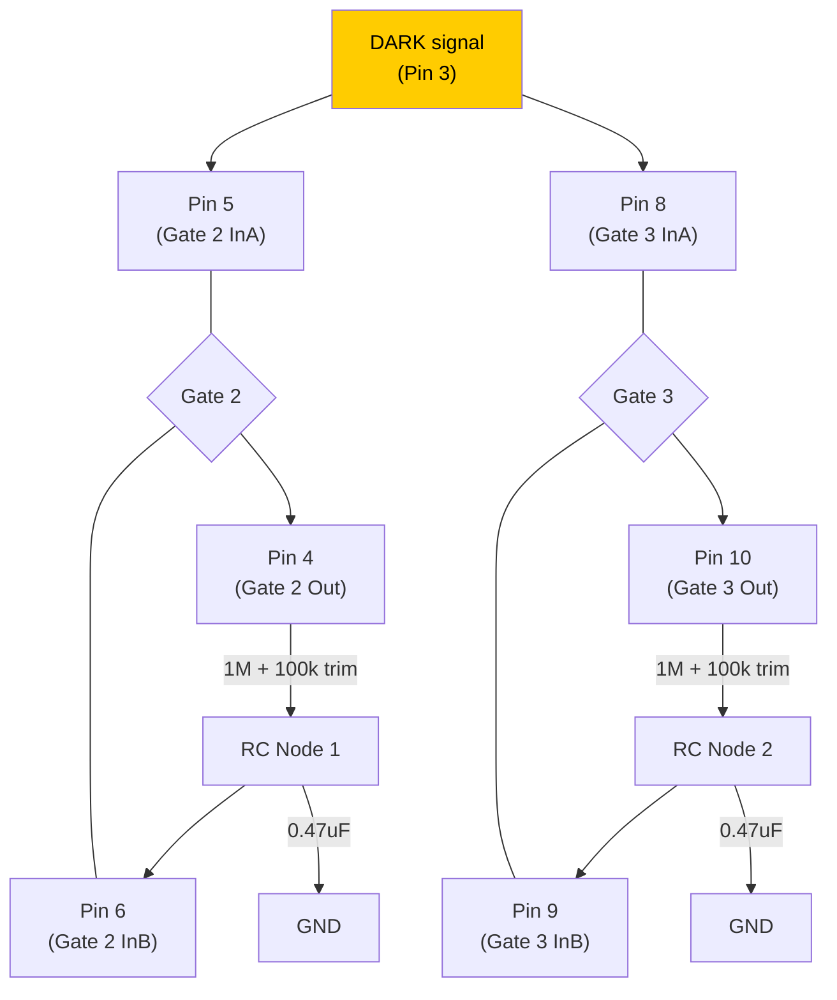
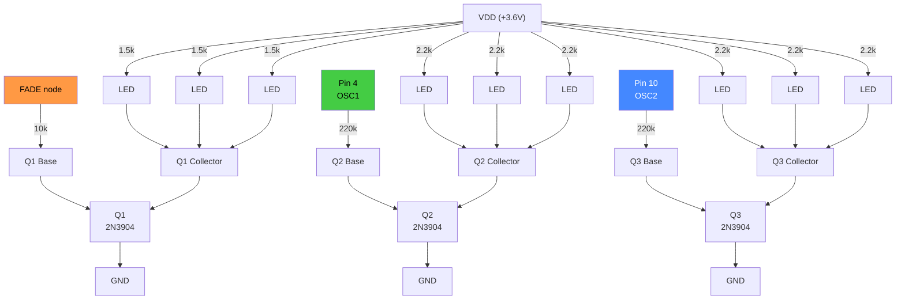

# Corrected Wiring Schematic — Diamond Mine Shimmer

## CD4093 Pin Assignment

```
              ┌────∪────┐
Gate1 InA  1 ─┤         ├─ 14  VDD (+3.6V)
Gate1 InB  2 ─┤         ├─ 13  Gate4 InA (→ VDD)
Gate1 Out  3 ─┤  CD4093 ├─ 12  Gate4 InB (→ VDD)
Gate2 Out  4 ─┤         ├─ 11  Gate4 Out  (N/C)
Gate2 InA  5 ─┤         ├─ 10  Gate3 Out
Gate2 InB  6 ─┤         ├─  9  Gate3 InB
      GND  7 ─┤         ├─  8  Gate3 InA
              └─────────┘
```



---

## Section A: Power and Charging

```
    Solar+ ──────┤>├──────── Battery+ (VDD)
               1N5819
    Solar- ────────────────── Battery- (GND)

    Battery: 3x AA NiMH in series = 3.6V nominal

    Bypass cap (close to IC pins):
    VDD (pin 14) ───┤├─── GND (pin 7)
                   0.1uF ceramic
```



---

## Section B: Dusk Detector (Gate 1)

```
    VDD ─── LDR ───┬─── Pin 1 (Gate1 InA)
                    │
                    ├─── Pin 2 (Gate1 InB)
                    │
                    └── 470k ──┬── 100k trimpot ── GND
                               │
                               └── 47k ── GND

    Pin 3 (Gate1 Out) = DARK signal
      Bright → LDR low-R → SENSE high → Output LOW  → LEDs OFF
      Dark   → LDR high-R → SENSE low → Output HIGH → LEDs ON
```



**Sensitivity adjustment:** Turn trimpot to set the light threshold where LEDs activate.
Higher total pull-down resistance = triggers at less darkness.

---

## Section C: Fade-In Ramp

```
    Pin 3 (DARK) ── 470k ──┬── FADE node
                            │
                          100uF electrolytic
                            │
                           GND

    τ = 470k x 100uF = 47 seconds
    LEDs begin glowing at ~10s (Vbe threshold)
    Full brightness at ~40s
```



**Fade-in timing:**

| Time after DARK goes HIGH | FADE voltage | LED state |
|---------------------------|-------------|-----------|
| 0 seconds | 0V | Off |
| 10 seconds | 0.7V | Barely glowing |
| 15 seconds | 1.0V | Dim glow |
| 25 seconds | 1.5V | Moderate brightness |
| 40 seconds | 2.0V | Near full brightness |
| 90+ seconds | ~3.5V | Full brightness |

---

## Section D: Oscillator 1 — Gated (Gate 2)

```
    Pin 5 (Gate2 InA) ──── Pin 3 (DARK signal)     ← gating input

    Pin 4 (Gate2 Out) ── 1M ── 100k trimpot ──┬── Pin 6 (Gate2 InB)
                                               │
                                             0.47uF film
                                               │
                                              GND

    DARK=LOW  → Output stuck HIGH, no oscillation, zero current
    DARK=HIGH → Oscillates at ~2.4–2.6 Hz (adjustable via trimpot)
```

---

## Section E: Oscillator 2 — Gated (Gate 3)

```
    Pin 8 (Gate3 InA) ──── Pin 3 (DARK signal)     ← gating input

    Pin 10 (Gate3 Out) ── 1M ── 100k trimpot ──┬── Pin 9 (Gate3 InB)
                                                │
                                              0.47uF film
                                                │
                                               GND

    Set trimpot to different position than Osc 1 for beat-frequency shimmer
```



**Frequency range with 1M fixed + 100k trimpot + 0.47uF:**

| Trimpot setting | Total R | Frequency | Character |
|-----------------|---------|-----------|-----------|
| 0 ohm (min) | 1.0M | 2.6 Hz | Quick shimmer |
| 50k (mid) | 1.05M | 2.5 Hz | Medium shimmer |
| 100k (max) | 1.1M | 2.4 Hz | Slightly slower |

---

## Section F: Unused Gate 4

```
    Pin 12 (Gate4 InA) ──── VDD
    Pin 13 (Gate4 InB) ──── VDD
    Pin 11 (Gate4 Out)      no connection
```

**Why this matters:** Floating CMOS inputs draw ~1 mA and risk latch-up. Always tie unused
inputs to a rail.

---

## Section G: LED Drivers

### Steady Bank (Q1) — base glow, fade-controlled

```
    FADE node ── 10k ──── Q1 Base (2N3904)
                          Q1 Emitter ── GND
                          Q1 Collector ──┬── LED1 cathode ── LED1 anode ── 1.5k ── VDD
                                         ├── LED2 cathode ── LED2 anode ── 1.5k ── VDD
                                         └── LED3 cathode ── LED3 anode ── 1.5k ── VDD
```

### Twinkle Bank 1 (Q2) — shimmer layer 1

```
    Pin 4 (OSC1) ── 220k ── Q2 Base (2N3904)
                             Q2 Emitter ── GND
                             Q2 Collector ──┬── LED ── 2.2k ── VDD
                                            ├── LED ── 2.2k ── VDD
                                            └── LED ── 2.2k ── VDD
```

### Twinkle Bank 2 (Q3) — shimmer layer 2

```
    Pin 10 (OSC2) ── 220k ── Q3 Base (2N3904)
                              Q3 Emitter ── GND
                              Q3 Collector ──┬── LED ── 2.2k ── VDD
                                             ├── LED ── 2.2k ── VDD
                                             └── LED ── 2.2k ── VDD
```



---

## Complete Net List

| Net Name | Connections |
|----------|------------|
| **VDD** | Battery+, Pin 14, Pin 12, Pin 13, LDR leg 1, LED anode resistors, 0.1uF cap |
| **GND** | Battery-, Pin 7, R_sense bottom, 100uF(-), 0.47uF(x2), Q1/Q2/Q3 emitters, 0.1uF cap |
| **SENSE** | LDR leg 2, Pin 1, Pin 2, R_sense top |
| **DARK** | Pin 3, Pin 5, Pin 8, 470k (to FADE) |
| **FADE** | 470k/100uF junction, 10k (to Q1 base) |
| **RC1** | 1M+trim/0.47uF junction, Pin 6 |
| **RC2** | 1M+trim/0.47uF junction, Pin 9 |
| **OSC1** | Pin 4, 1M (to RC1), 220k (to Q2 base) |
| **OSC2** | Pin 10, 1M (to RC2), 220k (to Q3 base) |
| **Q1_COL** | Q1 collector, Steady LED cathodes |
| **Q2_COL** | Q2 collector, Twinkle 1 LED cathodes |
| **Q3_COL** | Q3 collector, Twinkle 2 LED cathodes |
