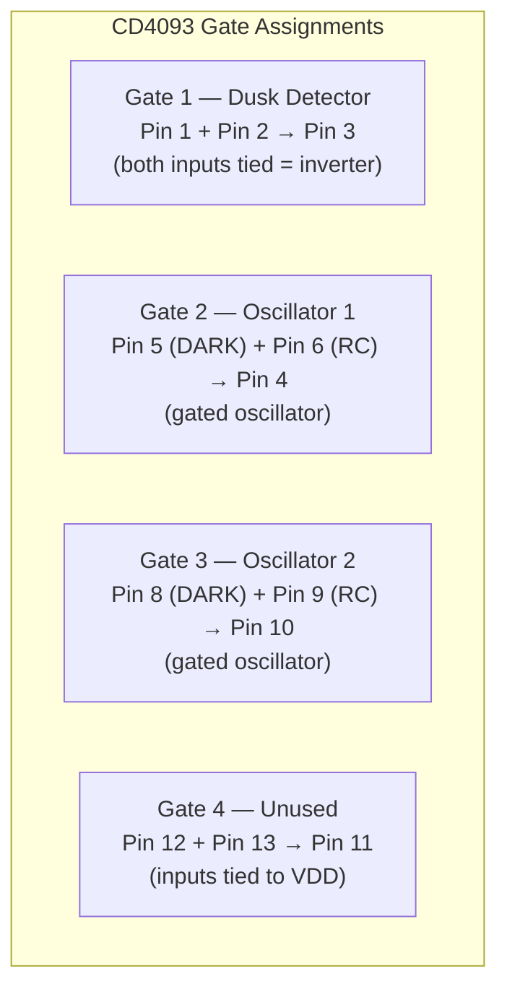
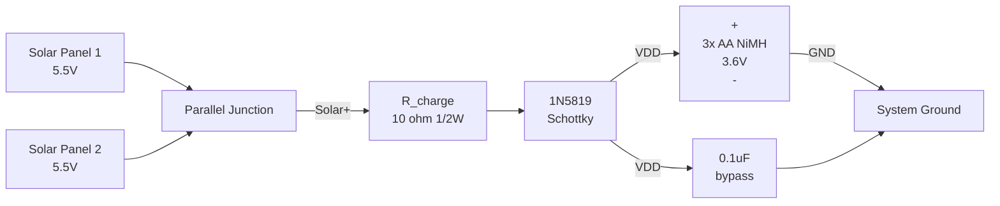
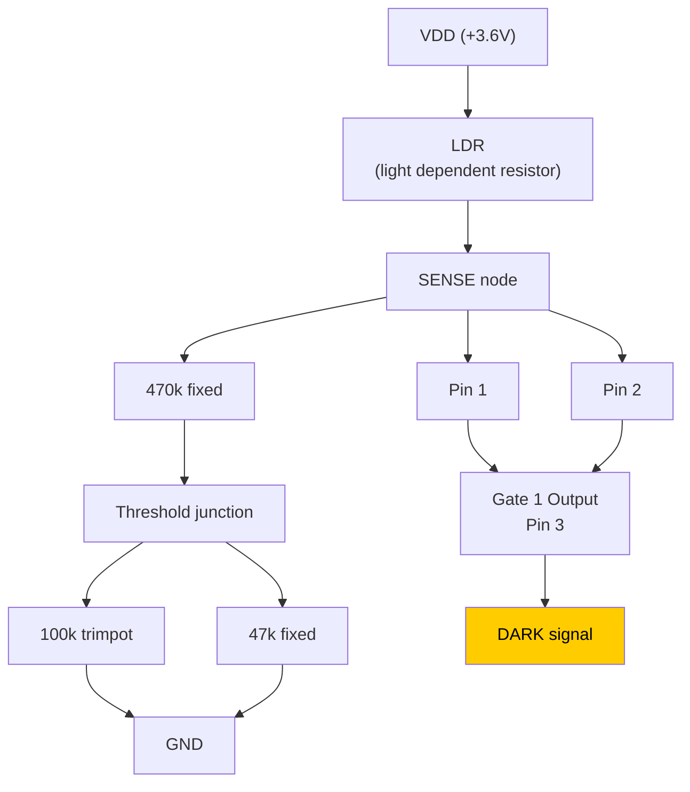
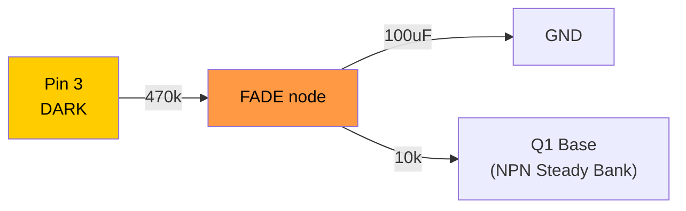
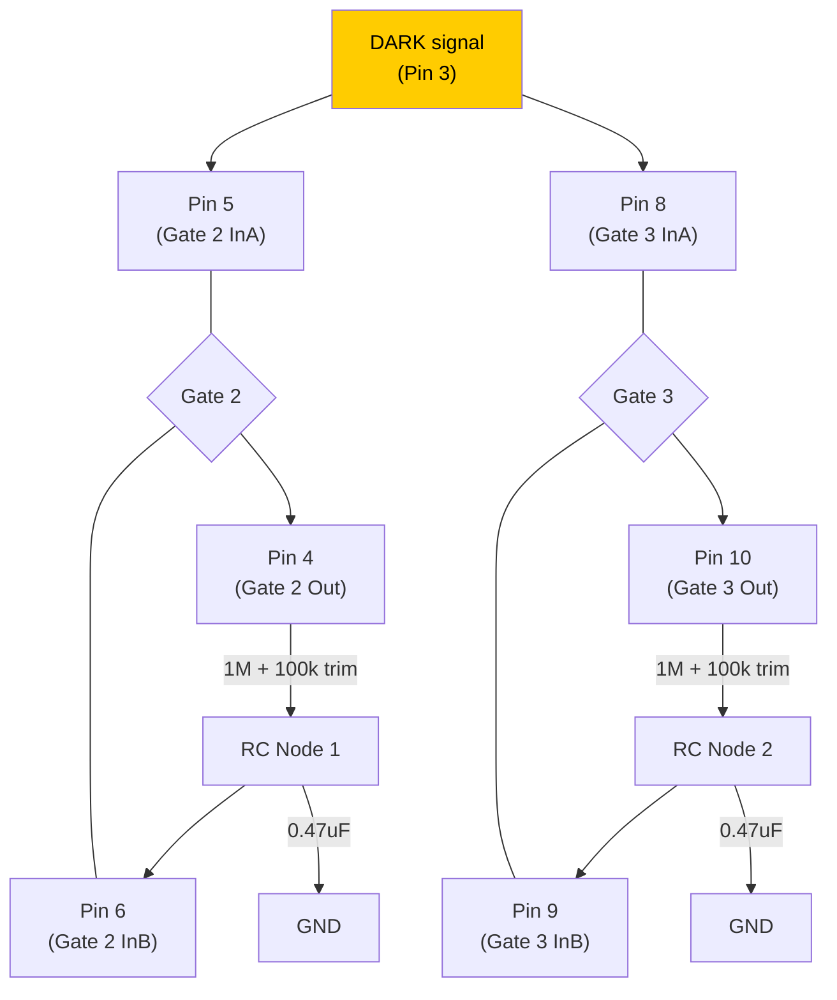
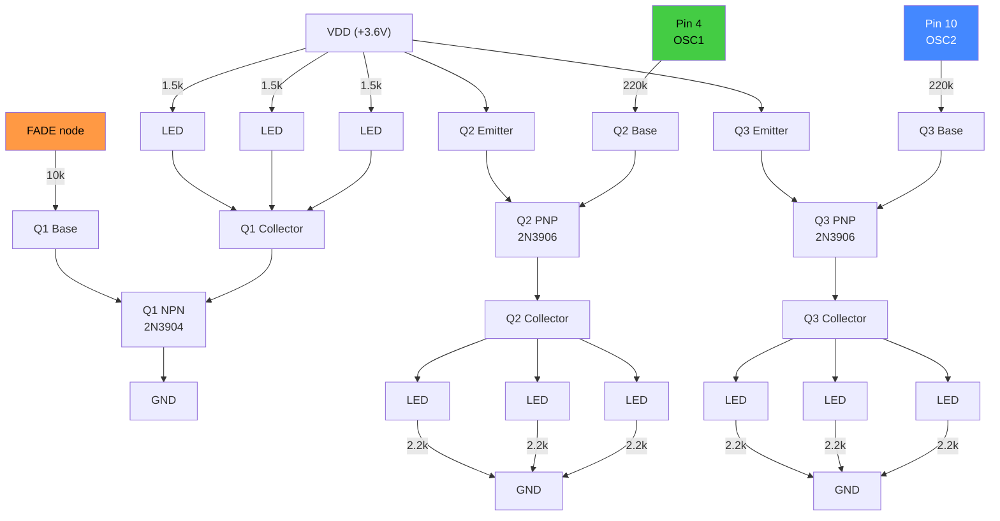

# Wiring Schematic — Diamond Mine Shimmer

## CD4093 Pin Assignment

```
              ┌────∪────┐
Gate1 InA  1 ─┤         ├─ 14  VDD (+3.6V)
Gate1 InB  2 ─┤         ├─ 13  Gate4 InA (→ VDD)
Gate1 Out  3 ─┤  CD4093 ├─ 12  Gate4 InB (→ VDD)
Gate2 Out  4 ─┤         ├─ 11  Gate4 Out  (N/C)
Gate2 InA  5 ─┤         ├─ 10  Gate3 Out
Gate2 InB  6 ─┤         ├─  9  Gate3 InB
      GND  7 ─┤         ├─  8  Gate3 InA
              └─────────┘
```



---

## Section A: Power and Charging

```
    Solar+ ── R_charge (10Ω) ──┤>├──────── Battery+ (VDD)
                              1N5819
    Solar- ──────────────────────────────── Battery- (GND)

    Battery: 3x AA NiMH in series = 3.6V nominal
    Solar panels: 5.5V, 80–100 mA each, wired in parallel
    R_charge limits trickle current to safe NiMH range (85–220 mA)

    Bypass cap (close to IC pins):
    VDD (pin 14) ───┤├─── GND (pin 7)
                   0.1uF ceramic
```



---

## Section B: Dusk Detector (Gate 1)

```
    VDD ─── LDR ───┬─── Pin 1 (Gate1 InA)
                    │
                    ├─── Pin 2 (Gate1 InB)
                    │
                    └── 470k ──┬── 100k trimpot ── GND
                               │
                               └── 47k ── GND

    Pin 3 (Gate1 Out) = DARK signal
      Bright → LDR low-R → SENSE high → Output LOW  → LEDs OFF
      Dark   → LDR high-R → SENSE low → Output HIGH → LEDs ON
```



---

## Section C: Fade-In Ramp

```
    Pin 3 (DARK) ── 470k ──┬── FADE node
                            │
                          100uF electrolytic
                            │
                           GND

    τ = 470k x 100uF = 47 seconds
    LEDs begin glowing at ~10s (Vbe threshold)
    Full brightness at ~40s
```



---

## Section D: Oscillator 1 — Gated (Gate 2)

```
    Pin 5 (Gate2 InA) ──── Pin 3 (DARK signal)     ← gating input

    Pin 4 (Gate2 Out) ── 1M ── 100k trimpot ──┬── Pin 6 (Gate2 InB)
                                               │
                                             0.47uF film
                                               │
                                              GND

    DARK=LOW  → Output stuck HIGH, no oscillation
               PNP transistor OFF → zero LED current
    DARK=HIGH → Oscillates at ~2.4–2.6 Hz (adjustable via trimpot)
               PNP transistor toggles → LEDs shimmer
```

---

## Section E: Oscillator 2 — Gated (Gate 3)

```
    Pin 8 (Gate3 InA) ──── Pin 3 (DARK signal)     ← gating input

    Pin 10 (Gate3 Out) ── 1M ── 100k trimpot ──┬── Pin 9 (Gate3 InB)
                                                │
                                              0.47uF film
                                                │
                                               GND

    Set trimpot to different position than Osc 1 for beat-frequency shimmer
```



**Frequency range with 1M fixed + 100k trimpot + 0.47uF:**

| Trimpot setting | Total R | Frequency | Character |
|-----------------|---------|-----------|-----------|
| 0 ohm (min) | 1.0M | 2.6 Hz | Quick shimmer |
| 50k (mid) | 1.05M | 2.5 Hz | Medium shimmer |
| 100k (max) | 1.1M | 2.4 Hz | Slightly slower |

---

## Section F: Unused Gate 4

```
    Pin 12 (Gate4 InA) ──── VDD
    Pin 13 (Gate4 InB) ──── VDD
    Pin 11 (Gate4 Out)      no connection
```

Floating CMOS inputs draw excess current and risk latch-up. Always tie unused
inputs to a rail.

---

## Section G: LED Drivers

### Steady Bank — Q1 (NPN 2N3904, low-side switch, fade-controlled)

```
    FADE node ── 10k ──── Q1 Base (2N3904 NPN)
                          Q1 Emitter ── GND
                          Q1 Collector ──┬── LED1 cathode ── LED1 anode ── 1.5k ── VDD
                                         ├── LED2 cathode ── LED2 anode ── 1.5k ── VDD
                                         └── LED3 cathode ── LED3 anode ── 1.5k ── VDD
```

Day: FADE = 0V → Q1 OFF → LEDs dark
Night: FADE ramps 0V → 3.6V over 47s → Q1 gradually turns on → LEDs bloom

### Twinkle Bank 1 — Q2 (PNP 2N3906, high-side switch)

```
                          VDD
                           │
                       Q2 Emitter (2N3906 PNP)
                           │
    Pin 4 (OSC1) ── 220k ── Q2 Base
                           │
                       Q2 Collector ──┬── LED anode ── LED cathode ── 2.2k ── GND
                                      ├── LED anode ── LED cathode ── 2.2k ── GND
                                      └── LED anode ── LED cathode ── 2.2k ── GND
```

Day: Pin 4 = HIGH (stuck) → Q2 base ≈ VDD → Veb ≈ 0 → Q2 OFF → LEDs dark
Night: Pin 4 oscillates → Q2 toggles → LEDs shimmer

### Twinkle Bank 2 — Q3 (PNP 2N3906, high-side switch)

```
                          VDD
                           │
                       Q3 Emitter (2N3906 PNP)
                           │
    Pin 10 (OSC2) ── 220k ── Q3 Base
                           │
                       Q3 Collector ──┬── LED anode ── LED cathode ── 2.2k ── GND
                                      ├── LED anode ── LED cathode ── 2.2k ── GND
                                      └── LED anode ── LED cathode ── 2.2k ── GND
```



---

## Complete Net List

| Net Name | Connections |
|----------|------------|
| **VDD** | Battery+, R_charge output, Pin 14, Pin 12, Pin 13, LDR leg 1, Steady LED anode resistors, Q2 emitter, Q3 emitter, 0.1uF cap |
| **GND** | Battery-, Pin 7, Trimpot/47k ground ends, 100uF(-), 0.47uF(x2), Q1 emitter, Twinkle LED cathode resistors, 0.1uF cap |
| **SOLAR+** | Solar panel positive bus, R_charge input |
| **CHARGE** | R_charge output, 1N5819 anode |
| **SENSE** | LDR leg 2, Pin 1, Pin 2, 470k top |
| **THRESH** | 470k bottom, 100k trimpot wiper/end1, 47k top |
| **DARK** | Pin 3, Pin 5, Pin 8, 470k fade top |
| **FADE** | 470k fade bottom, 100uF(+), 10k top |
| **RC1** | 1M+trim/0.47uF junction (osc 1), Pin 6 |
| **RC2** | 1M+trim/0.47uF junction (osc 2), Pin 9 |
| **OSC1** | Pin 4, 1M top (to RC1), 220k (to Q2 base) |
| **OSC2** | Pin 10, 1M top (to RC2), 220k (to Q3 base) |
| **Q1_COL** | Q1 collector, Steady LED cathodes (3x) |
| **Q2_COL** | Q2 collector, Twinkle 1 LED anodes (3x) |
| **Q3_COL** | Q3 collector, Twinkle 2 LED anodes (3x) |
