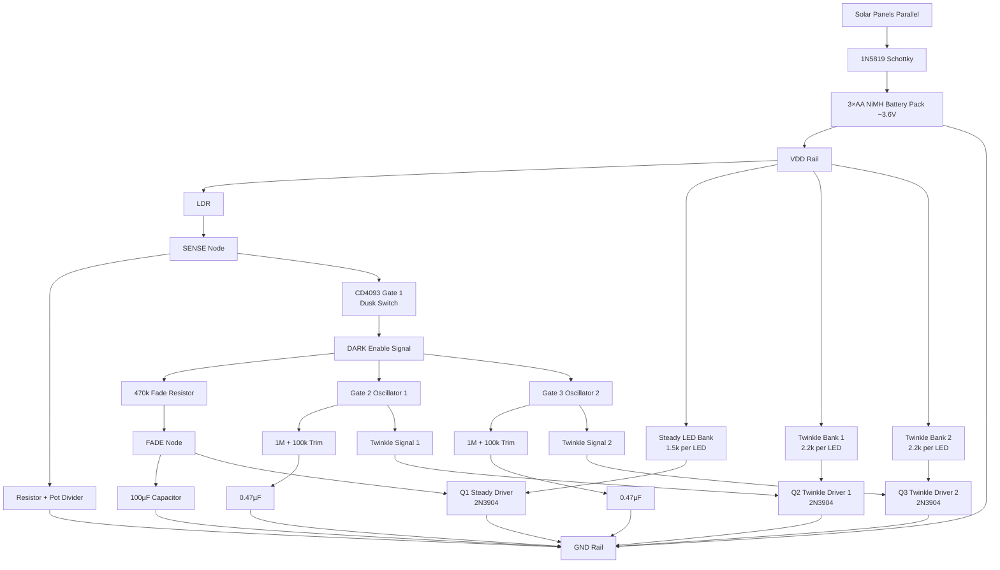

# Diamond Mine Shimmer Circuit

> A solar-powered, dusk-activated LED shimmer system that produces an organic, non-repeating sparkle field — no microcontroller required.

---

## Overview

This project is a tiny artificial "bioluminescent cave" engine: solar-fed, dusk-aware, and gently chaotic in the best analog way. A small indoor solar array trickle-charges a 3×AA NiMH pack through a Schottky diode, and the entire circuit runs directly from the battery at ultra-low current using CMOS Schmitt-trigger logic.

At sunset, an LDR-based dusk detector enables the system and feeds a slow fade-in ramp so the LEDs bloom smoothly instead of snapping on. Two independent CD4093 oscillator sections generate slightly different twinkle rates, which modulate separate LED banks through transistor drivers. The result is a layered light effect: a steady base glow plus two drifting shimmer layers that feel natural and "alive."

### Key Features

- **Zero firmware** — pure analog / CMOS logic, nothing to program
- **Solar self-sustaining** — indoor solar panels trickle-charge NiMH cells
- **Dusk-aware** — LDR senses ambient light and auto-activates at sunset
- **Smooth fade-in** — RC ramp prevents harsh snap-on
- **Organic shimmer** — two independent oscillators create non-repeating sparkle patterns
- **Ultra-low power** — CMOS logic + efficient LED drivers keep draw under 20 mA

---

## Project Documents

| Document | Description |
|---|---|
| [BOM.md](BOM.md) | Full bill of materials with values, quantities, and sourcing notes |
| [BUILD-GUIDE.md](BUILD-GUIDE.md) | Step-by-step assembly instructions |
| [DESIGN-NOTES.md](DESIGN-NOTES.md) | Circuit theory, timing calculations, and tuning tips |
| [schematic.png](schematic.png) | Wiring diagram (visual schematic) |

---

## Exported Engineering Files

| File | Format | Purpose |
|---|---|---|
| [diamond-mine-shimmer.cir](diamond-mine-shimmer.cir) | SPICE netlist | Analog simulation baseline |
| [diamond-mine-shimmer.sp](diamond-mine-shimmer.sp) | SPICE netlist | Alternate extension for simulators |
| [diamond-mine-shimmer.spice](diamond-mine-shimmer.spice) | SPICE netlist | Alternate extension for simulators |
| [diamond-mine-shimmer.v](diamond-mine-shimmer.v) | Verilog | Behavioral digital timing model |
| [diamond-mine-shimmer.vhd](diamond-mine-shimmer.vhd) | VHDL | Behavioral digital timing model |
| [BOM.csv](BOM.csv) | CSV | Machine-readable bill of materials |
| [diamond-mine-shimmer.kicad_pcb](diamond-mine-shimmer.kicad_pcb) | KiCad PCB | PCB layout container/template |
| [design-documentation.md](design-documentation.md) | Markdown | Text export of design documentation |

---

## System Architecture

```
┌─────────────┐     ┌──────────┐     ┌────────────┐
│ Solar Panels ├──►──┤ Schottky ├──►──┤ 3×AA NiMH  │
│  (parallel)  │     │  1N5819  │     │  ~3.6 V    │
└─────────────┘     └──────────┘     └─────┬──────┘
                                           │
                         ┌─────────────────┤
                         │            VDD Rail
                         ▼
                  ┌──────────────┐
                  │  LDR + Pot   │
                  │ Dusk Sensor  │
                  └──────┬───────┘
                         │ SENSE
                         ▼
                  ┌──────────────┐
                  │  CD4093 G1   │
                  │ Dusk Switch  │
                  └──────┬───────┘
                         │ DARK enable
            ┌────────────┼────────────┐
            ▼            ▼            ▼
     ┌────────────┐ ┌─────────┐ ┌─────────┐
     │  Fade Ramp │ │ CD4093  │ │ CD4093  │
     │ 470k+100µF │ │ Gate 2  │ │ Gate 3  │
     │            │ │ Osc ~1Hz│ │ Osc~0.7 │
     └─────┬──────┘ └────┬────┘ └────┬────┘
           ▼              ▼           ▼
     ┌─────────┐   ┌─────────┐ ┌─────────┐
     │Q1 Steady│   │Q2 Twink1│ │Q3 Twink2│
     │ Driver  │   │ Driver  │ │ Driver  │
     └────┬────┘   └────┬────┘ └────┬────┘
          ▼              ▼           ▼
     ┌─────────┐   ┌─────────┐ ┌─────────┐
     │Steady   │   │Twinkle  │ │Twinkle  │
     │LED Bank │   │Bank 1   │ │Bank 2   │
     │(1.5k/ea)│   │(2.2k/ea)│ │(2.2k/ea)│
     └─────────┘   └─────────┘ └─────────┘
```

---

## Wiring Diagram (Mermaid)



---

## Quick Start

1. Review the [BOM](BOM.md) and gather parts
2. Read the [Design Notes](DESIGN-NOTES.md) to understand the circuit
3. Follow the [Build Guide](BUILD-GUIDE.md) step by step
4. Refer to the [schematic](schematic.png) during assembly
5. Adjust trim pots and LDR sensitivity to taste
6. Place solar panels near a window, LEDs in your display — enjoy the shimmer

---

## License

This project is released into the public domain. Build it, modify it, share it freely.
