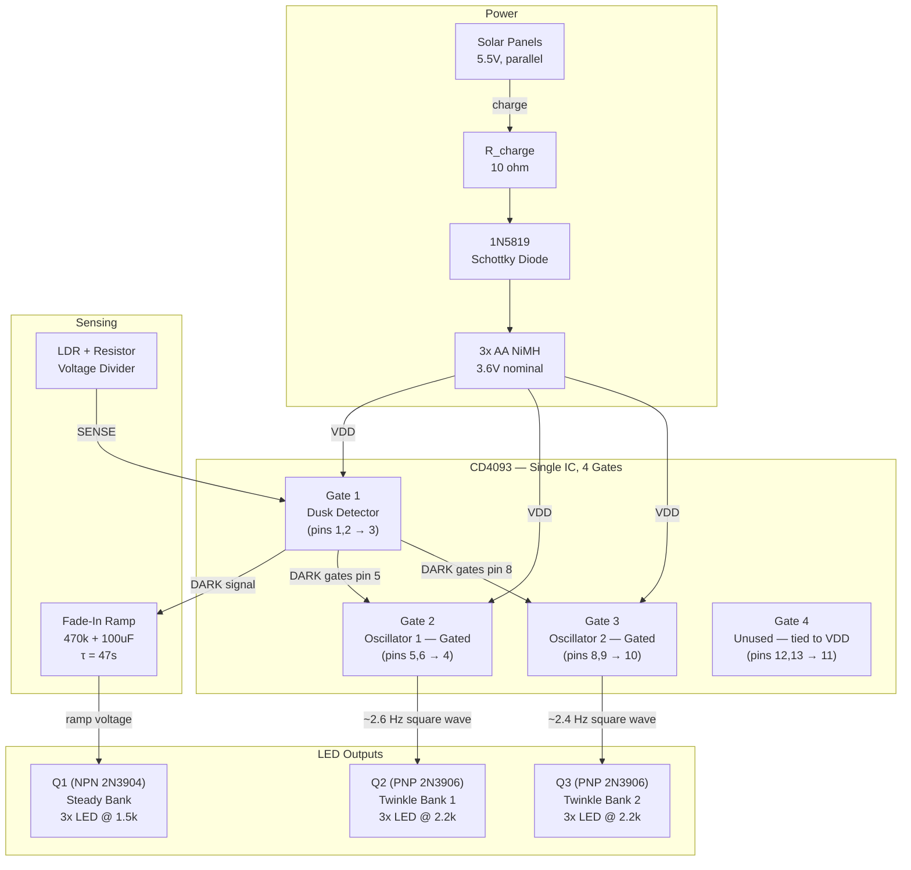
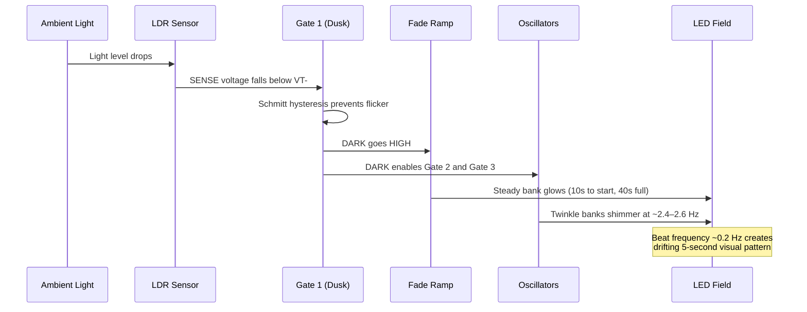

# Diamond Mine Shimmer Circuit — Final Design

A solar-charged, dusk-activated LED shimmer circuit. No microcontroller, no firmware —
pure analog CMOS logic and transistor drivers produce an organic, non-repeating sparkle
field that charges by day and shimmers by night.

## Documents

| File | Contents |
|------|----------|
| [BUILD-GUIDE.md](BUILD-GUIDE.md) | Step-by-step breadboard assembly and testing |
| [schematic.md](schematic.md) | Complete wiring schematic with gate assignments and net list |
| [bill-of-materials.md](bill-of-materials.md) | Full parts list with values, calculations, and cost |
| [breadboard-layout.md](breadboard-layout.md) | Physical layout with zone map and wire color guide |
| [circuit-evaluation.md](circuit-evaluation.md) | Performance characteristics and power budget |
| [circuit-evaluation-deep-dive.md](circuit-evaluation-deep-dive.md) | Extended design review with longevity analysis |
| [design-documentation.md](design-documentation.md) | Theory of operation, timing math, tuning guide |
| [bom.csv](bom.csv) | Machine-readable BOM for ordering |
| [diamond-mine-shimmer.cir](diamond-mine-shimmer.cir) | SPICE netlist for circuit simulation |
| [diamond-mine-shimmer.v](diamond-mine-shimmer.v) | Verilog behavioral model |
| [diamond-mine-shimmer.kicad_sch](diamond-mine-shimmer.kicad_sch) | KiCad schematic for PCB workflow |

## System Overview

## Signal Flow at Dusk

## Design Highlights

- **Solar self-sufficiency** — 5.5V panels with current-limited trickle charge
- **Smooth dusk activation** — Schmitt hysteresis prevents twilight flicker
- **Gentle 40-second fade-in** — RC ramp creates organic bloom
- **Multi-layer shimmer** — dual oscillator beats produce non-repeating patterns
- **Correct day/night gating** — PNP high-side switches ensure zero LED current in daylight
- **~5 mA active / ~7 uA standby** — months of battery life, easily solar-sustained
- **No microcontroller, no regulator, no firmware**
