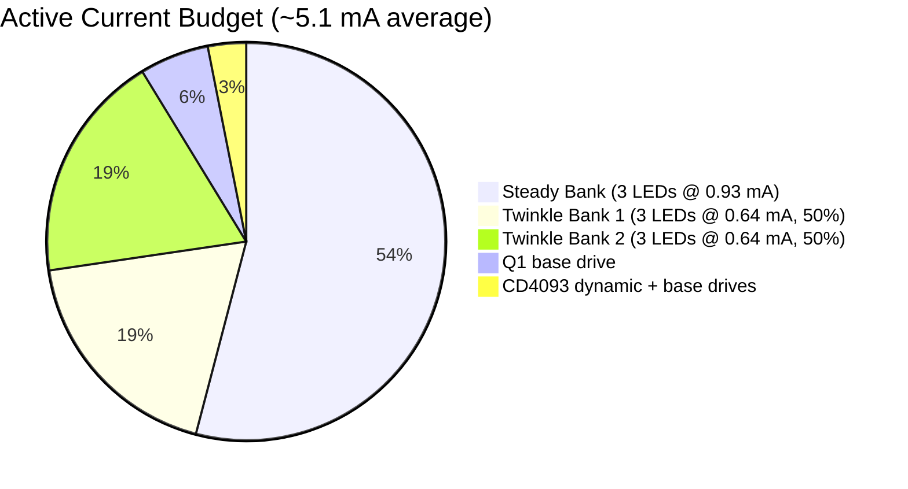

# Circuit Evaluation — Diamond Mine Shimmer

## Design Summary

Single CD4093 Schmitt-trigger NAND IC provides dusk detection (Gate 1) and two
gated oscillators (Gates 2 and 3). Solar panels charge NiMH batteries through a
Schottky diode with resistive current limiting. At dusk, an LDR triggers the
circuit: the steady LED bank fades in via an RC ramp through an NPN driver (Q1),
while two twinkle banks shimmer through PNP high-side drivers (Q2, Q3) toggled by
the gated oscillators. At dawn, the oscillators hold HIGH, PNP drivers turn OFF,
and the fade cap discharges — all LEDs go dark and standby draw falls to ~7 uA.

---

## Strengths

- **Dusk detector** — LDR voltage divider with Schmitt hysteresis (Gate 1 in inverter
  mode). Clean switching, no twilight flicker. ~1.08V hysteresis band at 3.6V VDD.

- **Fade-in ramp** — 470k + 100uF (τ = 47s). LEDs begin glowing at ~10 seconds, full
  brightness around 40 seconds. Organic bloom effect.

- **Dual non-synchronized oscillators** — Two square waves at slightly different
  frequencies (~2.4 Hz and ~2.6 Hz) create beat patterns with ~5-second drift cycles
  that never mechanically repeat.

- **PNP high-side twinkle switches** — NAND outputs go HIGH when DARK is LOW (day).
  PNP transistors (2N3906) are OFF when base ≈ VDD. This ensures **zero twinkle LED
  current during daylight** — a requirement for net-positive solar charging.

- **NPN low-side steady switch** — Q1 driven by FADE ramp (0V during day) naturally
  stays OFF. Provides smooth linear brightness control during nighttime fade-in.

- **Current-limited solar charging** — R_charge (10 ohm) self-tapers the charge rate:
  220 mA at 3.0V battery (C/9) down to 85 mA at 4.35V (C/24). Safe for NiMH
  indefinite trickle with no charge controller required.

- **Per-LED current limiting** — Individual resistors ensure equal brightness across
  all LEDs despite manufacturing Vf variation.

- **1N5819 Schottky** — 0.3V drop vs 0.6V for silicon. Preserves millivolts at 3.6V.

---

## Current Draw Summary

| State | Current | Battery Life (2000 mAh) |
|-------|---------|------------------------|
| Daylight (standby) | ~7 uA | ~32 years (effectively infinite) |
| Darkness (all LEDs, average) | ~5.1 mA | ~390 hours (~16 days) |
| Darkness (peak, all on) | ~7.0 mA | ~285 hours (~12 days) |

---

## Solar Energy Balance

| Parameter | Value |
|-----------|-------|
| Solar panels | 2x 5.5V, 100 mA each, parallel |
| Daily charge (4 hrs effective sun) | 200 mA × 4 hrs = 800 mAh |
| Daily discharge (10 hrs night) | 5.1 mA × 10 hrs = 51 mAh |
| **Net daily surplus** | **+749 mAh** |
| Minimum sun to sustain | 0.26 hrs (16 min) with 2 panels |

The circuit is easily solar self-sustaining with even modest indoor light.

---

## Daytime Behavior

| Component | State | Current |
|-----------|-------|---------|
| LDR divider | SENSE ≈ VDD → Gate 1 output LOW | ~7 uA |
| Gate 1 output (DARK) | LOW | — |
| Fade ramp (100uF) | Discharged (0V) | 0 |
| Q1 (NPN) | OFF (base = 0V) | 0 |
| Gate 2 output (Pin 4) | Stuck HIGH | — |
| Gate 3 output (Pin 10) | Stuck HIGH | — |
| Q2 (PNP) | OFF (base ≈ VDD, Veb ≈ 0) | 0 |
| Q3 (PNP) | OFF (base ≈ VDD, Veb ≈ 0) | 0 |
| **Total standby** | | **~7 uA** |

---

## Nighttime Behavior

| Component | State | Current |
|-----------|-------|---------|
| LDR divider | SENSE ≈ low → Gate 1 output HIGH | ~2.4 uA |
| Gate 1 output (DARK) | HIGH | — |
| Fade ramp | Charges 0V → 3.6V over ~47s | — |
| Q1 (NPN) | ON (linear → saturated) | See LED bank |
| Gate 2 output | Oscillating ~2.6 Hz | ~50 uA |
| Gate 3 output | Oscillating ~2.4 Hz | ~50 uA |
| Q2 (PNP) | Toggling (50% duty) | See LED bank |
| Q3 (PNP) | Toggling (50% duty) | See LED bank |
| Steady LEDs (3x) | 0.93 mA each | 2.79 mA |
| Twinkle 1 LEDs (3x, 50%) | 0.64 mA each × 50% | 0.96 mA |
| Twinkle 2 LEDs (3x, 50%) | 0.64 mA each × 50% | 0.96 mA |
| Base drives | Q1: 0.29 mA, Q2/Q3: 0.029 mA each | 0.35 mA |
| **Total active (average)** | | **~5.1 mA** |

---

## Charge Current Profile

| Battery Voltage | Charge Current | Rate | Notes |
|----------------|---------------|------|-------|
| 3.0V (discharged) | 220 mA | C/9 | Brief, acceptable |
| 3.6V (nominal) | 160 mA | C/12.5 | Normal operating point |
| 4.0V (near full) | 120 mA | C/17 | Safe |
| 4.35V (fully charged) | 85 mA | C/24 | Indefinite trickle safe |

---

## Known Limitations

| # | Item | Severity | Notes |
|---|------|----------|-------|
| 1 | No NiMH over-discharge cutoff | Minor | CD4093 degrades below ~3V, providing rough natural cutoff. For extra protection, add a voltage supervisor IC. |
| 2 | No power switch | Minor | Fine for permanent install. Add SPST toggle for debugging. |
| 3 | White/blue LEDs very dim | Info | Vf ~3.0V leaves only ~0.4V headroom. Use red/amber/yellow (Vf ~1.8–2.1V). |
| 4 | Breadboard not permanent | Info | Transfer to perfboard for installations lasting >1 year. |
| 5 | Twinkle banks lack fade-in | Aesthetic | They appear abruptly when oscillators start. Steady bank fades smoothly. |
| 6 | Narrow oscillator trim range | Info | 2.4–2.6 Hz (8% span). Use 500k trimpots for wider range. |
